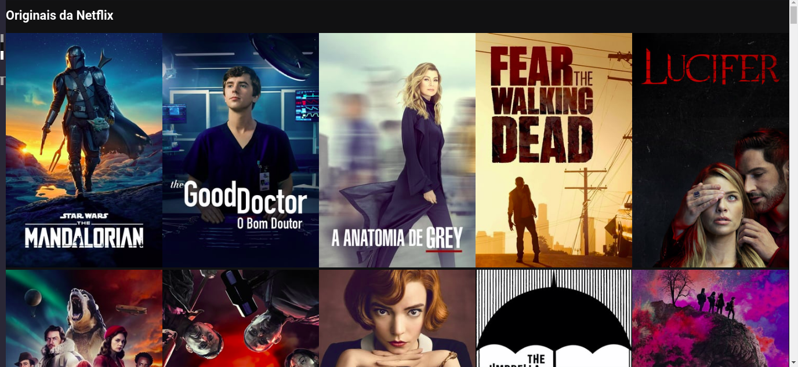

### Projeto Netflix clone usando a tecnologia <b>REACJS</b>
- Projeto que retrada as funcionalidades  basica da plataforma netflix..

- Dentro do <b>README</b> da pasta do projeto está tudo que foi ou está sendo usando.
   * https://github.com/thiagoadssilva/netflixClone/blob/main/clone/README.md

## <b>Inicio</b> do desenvolvimento do clone

## <b>Inicio da configuração do CSS</b> do desenvolvimento do clone

## Criando a parte do head da plataforma, onde vai ficar os <b>seriados em destaque .

## Finalizada a parte do head da plataforma, onde vai ficar os <b>seriados em destaque .

